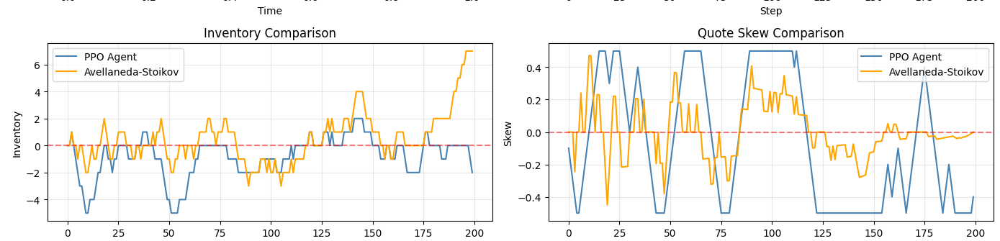
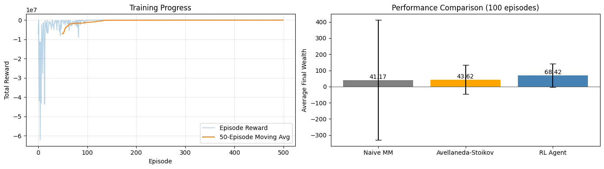
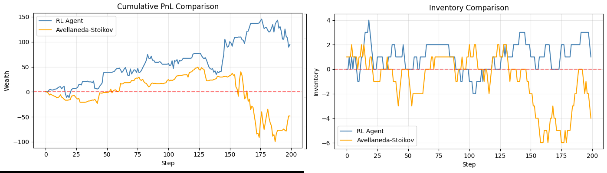
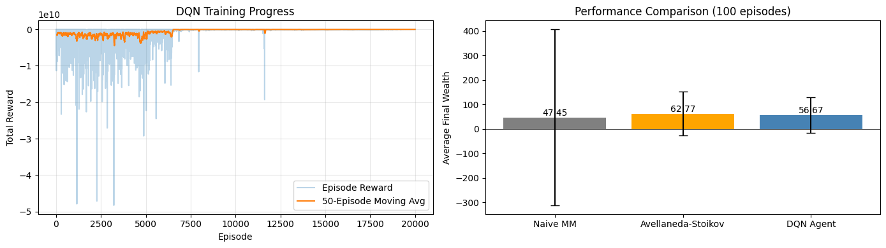
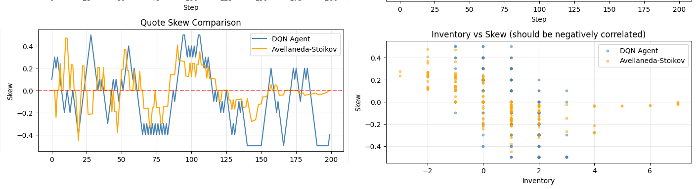

# Digital Market Maker (Reinforcement Learning)

A Python-based high-frequency trading simulation that optimises bid-ask spreads using reinforcement learning to manage inventory risk.

## Project Overview

This project simulates a **Limit Order Book** environment to compare different RL algorithms effectiveness in high-frequency market making, using both the famous **Avellaneda-Stoikov** model and a naive market maker as a benchmark. Unlike directional strategies that speculate on price movement, these models act as liquidity providers. They quote two-sided markets to capture the spread while solving the **Inventory Control Problem** via reinforcement learning.

The simulation models asset prices using **Geometric Brownian Motion** and order flow using **Poisson Processes**, creating a stochastic environment to test the robustness of these algorithms.

## Key Features

### 1. Market Simulation
The simulation creates a realistic closed-loop laboratory:
* **Price Dynamics:** Generates random prices using a drift-less random walk ($dS_t = \sigma S_t dW_t$).
* **Order Flow:** Simulates the "Crowd" using Poisson arrival intensities.
* **Fill Probability:** Uses an exponential decay function where the probability of a fill decreases as the spread widens:
    $$P(fill) = A \cdot e^{-k \cdot \delta}$$

### 2. PPO Agent
An agent trained using a proximal policy optimisation algorithm, with the following reward structure:
* **$Reward = C + E - T$**

Where C is the reward for correcting inventory risk, given by:
* **$C = 10(\lvert \text{previous inventory} \rvert - \lvert \text{current inventory} \rvert)$**

E is the edge for making a trade with a positive expected value, given by:
* **$E = 10(\text{fair price - bid}) + 10(\text{ask - fair price})$**

With each respective term of this reward only being given if the bid/ask is filled.

And T is the penalty for terminal inventory, given by:
* **$T = (\text{terminal inventory})^2$**

### 3. Policy Gradient Agent
An agent trained using a policy gradient algorithm, with the following reward structure:
* **$Reward = E - I$**

Where E is the edge for making a trade with a positive expected value, given by:
* **$E = 1000(\text{fair price - bid}) + 1000(\text{ask - fair price})$**

With each respective term of this reward only being given if the bid/ask is filled.

And I is the inventory penalty for holding inventory risk at a given time-step, given by:
* **$I = (\text{price})\times(\text{time step})\times(\text{inventory})^2$**

### 4. DQN Agent
An agent trained using a deep Q-learning algorithm, using a similar reward structure to the agent trained using a policy gradient algorithm (but with different scalings).

### 5. Avellaneda-Stoikov Agent
Implements the closed-form approximation of the Hamilton-Jacobi-Bellman equation to dynamically adjust quotes:
* **Reservation Price ($r$):** Skews the center price based on current inventory to encourage mean reversion.
* **Optimal Spread ($\delta$):** Widens the spread during periods of high volatility ($\sigma$) or low market liquidity ($k$).

### 6. Naive Agent
Maintains a constant spread of 0.5 around the fair price irrespective of inventory risk.

# Quantitative Theory

## 1. Reinforcement Learning 

### 1.1 Policy Gradient Methods: Direct Policy Optimization

The REINFORCE algorithm parameterizes the policy $\pi_\theta(a|s)$ given a certain state and optimizes using gradient ascent on the expected return, given by:

$$\nabla_\theta J(\theta) = \mathbb{E}_{\tau \sim \pi_\theta}\left[\sum_{t=0}^T \nabla_\theta \log \pi_\theta(a_t|s_t) \cdot G_t\right]$$

where $G_t = \sum_{k=t}^T \gamma^{k-t} r_k$ is the **return-to-go**. The key insight here is the **log-likelihood ratio trick**: we sample trajectories and increase the probability of actions that led to high returns.

**Critical Challenge, High Variance:** The Monte Carlo estimate of $G_t$ suffers from severe variance due to stochastic fill dynamics. This project implements **baseline subtraction** using a learned value function $V_\phi(s_t)$ to compute advantages:

$$A_t = G_t - V_\phi(s_t)$$

This variance reduction technique is essential, raw returns in market making are dominated by noise from random fills and price movements, making gradient estimates unreliable without variance control.

### 1.2 Proximal Policy Optimization: Constrained Policy Updates

PPO addresses policy gradient instability through **trust region optimization**. The clipped surrogate objective ensures policy updates remain within a safe neighborhood:

$$L^{CLIP}(\theta) = \mathbb{E}_t\left[\min\left(r_t(\theta)\hat{A}_t, \text{clip}(r_t(\theta), 1-\epsilon, 1+\epsilon)\hat{A}_t\right)\right]$$

where $r_t(\theta) = \frac{\pi_\theta(a_t|s_t)}{\pi_{\theta_{old}}(a_t|s_t)}$ is the **probability ratio**.

**Why PPO Excels in Market Making:** The clipping mechanism inhibits catastrophic policy collapses which is critical when learning inventory control. Without clipping, a single bad update could cause the agent to permanently adopt an inventory accumulating policy where it exploits favorable random walks rather than learning optimal market making strategy. PPO's conservative updates allow the agent to gradually learn the perfect balance between spread capture and risk management.

### 1.3 Deep Q-Networks: Value-Based Temporal Difference Learning

DQN approximates the action-value function $Q(s,a)$ representing expected return from taking action $a$ in state $s$. The **Bellman optimality equation** provides the learning target:

```math
Q^{*}(s,a) = \mathbb{E}_{s'}\left[r + \gamma \max_{a'} Q^{*}(s', a')\right]
```

DQN employs two major techniques for stabilization:

1. **Experience Replay:** Stores transitions $(s, a, r, s')$ in a replay buffer and samples mini-batches to break temporal correlations that destabilize learning.

2. **Target Networks:** Uses a slowly-updating target network $Q_{\theta^-}$ to compute TD targets, preventing the moving target problem:

$$\mathcal{L}(\theta) = \mathbb{E}_{(s,a,r,s') \sim \mathcal{D}}\left[\left(r + \gamma \max_{a'} Q_{\theta^-}(s', a') - Q_\theta(s, a)\right)^2\right]$$

## 2. Reward Engineering

### 2.1 The Overfitting Pathology

A failure occurs when agents optimize **pure PnL rewards** in stochastic environments: they learn to exploit favorable random walks rather than robust and repeatable market-making principles. An agent might accumulate massive long positions during an upward drift episode, earning high rewards but learning an extremely fragile strategy that breaks when the luck dissapears.

### 2.2 Decomposed Reward Structure

This project implements a **reward decomposition** that explicitly shapes the desired behavior:

**Edge Capture Component ($E$):**
$$E = \alpha[(\text{fair price - bid}) + (\text{ask - fair price})]$$

This rewards profitable spread capture while remaining indifferent to directional price movement. The agent learns spread optimization without following market drift, creating a robust market-neutral strategy.

**Inventory Correction Component ($C$):**
$$C = \beta(|q_{t-1}| - |q_t|)$$

Directly rewards inventory reduction, aligning with PPO's trajectory-based learning. This creates a natural curriculum that teaches the agent that simply avoiding excessive inventory yields positive rewards; later, the agent will then refine its strategy to balance inventory control with profit opportunities.

**Terminal Liquidation Penalty ($T$):**
$$T = \lambda q_T^2$$

Imposes an episode-level objective without interfering with intermediate learning. The quadratic form ensures that the penalty is always positive and that large positions are exponentially penalized, a $q_T = 10$ position incurs 100× the penalty of $q_T = 1$.

### 2.3 Reward Scaling and Multi-Objective Balance

The relative scaling of $\alpha$, $\beta$, $\lambda$ determines the **Pareto frontier** of risk-return trade-offs. This project demonstrates that different RL algorithms require different scalings:

- **Policy Gradients:** High $\lambda$ (immediate inventory penalty) establishes a strong gradient signal early in training
- **PPO:** Moderate $\lambda$ with emphasis on $C$ (correction reward) leverages trajectory credit assignment
- **DQN:** Dominant early inventory penalty helps accurate Q-value bootstrapping for risky states

This algorithm-specific reward tuning reflects deep understanding of each method's learning dynamics, not just empirical trial-and-error.

## 3. The Market Making Problem as a Stochastic Control Framework

Market making fundamentally presents a **continuous-time stochastic optimal control problem** where the agent must optimize two objectives: profit maximization through spread capture and inventory risk minimization. The value function $V(t, S_t, q_t)$ represents the expected terminal wealth given current time $t$, mid-price $S_t$, and inventory position $q_t$.

The **Hamilton-Jacobi-Bellman (HJB) equation** characterizes the optimal policy:

$$ \frac{\partial V}{\partial t} + \sup_{\delta^a,\delta^b} \Bigl( \lambda^a(\delta^a)\bigl[S_t + \delta^a - V(t,S_t,q) + V(t,S_t,q+1)\bigr] + \lambda^b(\delta^b)\bigl[V(t,S_t,q) - (S_t - \delta^b) + V(t,S_t,q-1)\bigr] \Bigr) + \frac{1}{2}\sigma^2 S_t^2 \frac{\partial^2 V}{\partial S^2} = 0 $$

This PDE captures the problem: the agent must choose bid and ask spreads ($\delta^b$, $\delta^a$) to maximize the expected value, accounting for stochastic fill rates $\lambda(\delta) = Ae^{-k\delta}$ and Brownian price dynamics $dS_t = \sigma dW_t$.

## 4. Avellaneda-Stoikov: Closed-Form Approximation via Asymptotic Analysis

The Avellaneda-Stoikov model provides an **analytically tractable approximation** by assuming exponential utility $U(x) = -e^{-\gamma x}$ with risk aversion parameter $\gamma$. Through asymptotic expansion as $\gamma \to 0$, the optimal quotes decompose into:

**Reservation Price (Inventory-Adjusted Indifference Price):**
$$r(s, q, t) = s - q \gamma \sigma^2 (T - t)$$

This represents the **indifference price** at which the agent is neutral between executing or not, given current inventory exposure. The term $q \gamma \sigma^2 (T - t)$ quantifies the **inventory risk premium**: positions are more costly to hold when time-to-expiry is long or volatility is high.

**Optimal Spread (Liquidity Provision Trade-off):**
$$\delta^* = \frac{\gamma \sigma^2 (T-t)}{2} + \frac{1}{\gamma} \ln\left(1 + \frac{\gamma}{k}\right)$$

The first term represents **volatility risk compensation** and widens spreads to protect against adverse selection during volatile periods. The second term captures the **order flow elasticity** the spread widens when market depth is thin (low $k$) to compensate for reduced fill probabilities.

## 5. The Fundamental Theorem of Market Making

Across all approaches, both analytical (Avellaneda-Stoikov) and learned (RL), the **fundamental insight** stays the same: optimal market making requires **dynamic adjustment of quotes** based on:

1. **Current inventory exposure** ($q$)
2. **Market volatility** ($\sigma$)  
3. **Time horizon** ($T - t$)
4. **Order flow elasticity** ($k$)

The RL agents learn this principle **implicitly** through reward optimization, while AS derives it **explicitly** from stochastic control theory. This convergence validates both approaches: when properly designed, learned policies approximate theoretically optimal strategies, while theoretical models guide reward engineering and architectural choices in deep RL systems.

## 6. Monte Carlo Validation: Statistical Robustness Through Repeated Trials

### 6.1 The Necessity of Ensemble Testing

A single training run or evaluation episode provides insufficient evidence of an RL agent's true performance in stochastic environments. Market making strategies face two sources of randomness:

1. **Price path variability**: Geometric Brownian Motion generates infinite possible trajectories
2. **Order flow stochasticity**: Poisson arrival processes create random fill timing even for identical quote placements

An agent might achieve high PnL in a single episode simply by encountering favorable price drift, or suffer losses despite sound strategy due to unlucky fill timing. **Monte Carlo simulation** addresses this by averaging performance across many independent episodes, allowing us to distinguish skill from luck.

### 6.2 Statistical Framework

This project evaluates each agent (RL-trained, Avellaneda-Stoikov, Naive) across **100 independent simulations**, each with different random seeds for both price evolution and order arrivals. For each agent, we compute:

**Mean Performance ($\bar{\pi}$):**
```math
\bar{\pi} = \frac{1}{N} \sum_{i=1}^{N} \pi_i
```

where $\pi_i$ is the terminal PnL from simulation $i$ and $N = 100$.

**Variance ($\sigma^{2}_{\pi}$):**
```math
\sigma^{2}_{\pi} = \frac{1}{N-1} \sum_{i=1}^{N} (\pi_i - \bar{\pi})^{2}
```

### 6.3 Detecting Overfitting vs. Genuine Learning

Monte Carlo testing reveals whether RL agents learned robust strategies or merely overfitted to training episodes:

**Overfitted agents exhibit:**
- High variance ($\sigma_{\pi}$) across simulations
- Performance highly sensitive to initial price or random seed
- Significantly worse performance than training episodes

**Robustly trained agents exhibit:**
- Variance comparable to or lower than Avellaneda-Stoikov
- Consistent performance across diverse market conditions
- Mean performance matching or exceeding theoretical benchmarks

The 100-simulation ensemble effectively stress-tests each strategy against the full distribution of possible market realizations, ensuring reported results reflect genuine strategic superiority rather than statistical artifacts.

### 6.4 Computational Considerations

Running 100 simulations per agent represents a **computational investment** that trades off accuracy for runtime:

- **N = 10 simulations**: Fast but high sampling error ($\pm 32\%$ standard error)
- **N = 100 simulations**: Balanced ($\pm 10\%$ standard error)
- **N = 1000 simulations**: Highest precision ($\pm 3\%$ standard error) but 10× runtime

This project uses N = 100 as the optimal balance for producing high quality results while maintaining reasonable evaluation times. The Central Limit Theorem ensures that with 100 samples, the distribution of mean PnL is approximately normal regardless of the underlying PnL distribution, validating parametric statistical tests.

# Simulation Results

## 1. PPO Agent

<p align="center">
  
</p>

The left panel shows that the PPO agent successfully learned a market making policy. The training stabilized around episode 150-200, the high initial variance represents the exploration phase where the agent tested various strategies, including some that led to extreme penalty.

The PPO Agent achieved a mean PNL of $67.30 with a standard deviation of 72.24 across the 100 simulations, the PNL is similar to the agent using the Avellaneda-Stoikov model but with a reduced variance (-23%) demonstrating that the PPO agent's inventory control outperforms the Avellaneda-Stoikov model.

We see the PPO agent significantly outperform the Naive market maker with a 21.5% higher PNL and a 95% reduction in variance.

<p align="center">
  
</p>

This example of a single simulation shows how the PPO agent adjusts the skew to maintain robust, mean-reverting inventory control.

## 2. Policy Gradient Agent

<p align="center">
  
</p>

The left panel shows that the Policy Gradient agent also successfully learned a market making policy. The training stabilized around episode 100, the high initial variance represents the exploration phase where the agent tested various strategies, including some that led to extreme penalty.

The Policy Gradient Agent achieved a mean PNL of $68.42 with a standard deviation of 72.06 across the 100 simulations, significantly outperforming the agent using the Avellaneda-Stoikov model with a 57% higher PNL and 35% less variance. It also significantly outperformed the agent using a naive spread, with a 66% higher PNL and 96% less variance.

<p align="center">
  
</p>

This example of a single simulation demonstrates how the Policy Gradient agents robust inventory control lead to a higher PNL with reduced variance in comparison to the agent using Avellaneda-Stoikov approximation.

## 3. Deep Q-Learning Agent

<p align="center">
  
</p>

The left panel shows that the Deep Q-Learning agent also successfully learned a market making policy, however it require significantly longer for the training to stabalise. The training stabilized around episode 7000, with extreme variance over this period.

The Deep-Q-Learning Agent achieved a mean PNL of $56.67 with a standard deviation of 72.79 across the 100 simulations. Although on a pure PNL basis it was outperformed by the agent using the Avellenada-Stoikov model by 11%, it achieved its profit with 33% less variance, demonstrating strong inventory control but slightly weaker edge capture.

It also significantly outperformed the naive market maker with 32% higher PNL with 94% less variance.

<p align="center">
  
</p>

This example of a single demonstration shows how the Deep Q-Learning agent adapts its skew to manage inventory. What is interesting about this is that the Deep Q-Learning agent seems to be more precise in its skew adjustments compared to the other RL agents.

# Summary
All three different RL algorithms (PPO, Policy Gradient, and Deep Q-Learning) were succesfully trained to solve the market making problem, with all agents learning effective inventory control strategies. The Policy Gradient agent and the PPO agent achieved the best overall performanc in the experiment, when considering both PNL and variance. 

Deep Q-Learning required significantly longer training (~7000 episodes vs ~150-200) but demonstrated the most precise skew adjustments and strong risk management despite a lower PnL. This reduced PNL is likely due to the fact that it struggles with the naturally continuous nature of quote placement.

All RL agents dramatically outperformed the naive market maker, achieving 21-66% higher PnL with 94-96% variance reduction. These results validate the hypothesis that properly designed reward functions allow RL agents to learn and exceed theoretically optimal strategies, with each algorithm exhibiting distinct trade-offs between training efficiency, PnL generation, and risk control.


